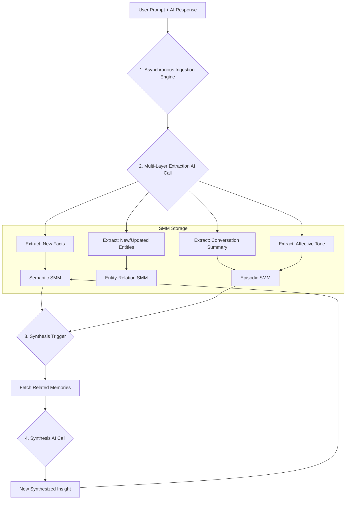

# **SoulyCore Cognitive Architecture v2.0**

## **1. The Vision & Core Problems (The "Why")**

The purpose of this architecture is to evolve SoulyCore from a chat application with memory features into a true **Cognitive Companion**. It addresses the fundamental limitations of traditional AI assistants and our own v1 system:

*   **Digital Amnesia:** Assistants that forget context between sessions, forcing user repetition.
*   **Context Brittleness:** The inability to differentiate between various types of knowledge (facts vs. events vs. skills) leads to irrelevant information flooding the context window.
*   **Lack of Synthesis:** The system remembers facts but does not actively form new connections or insights from the information it gathers.
*   **Inefficient Scaling:** A monolithic memory pipeline is not adaptable for specialized agents or diverse data sources.

This v2.0 architecture solves these problems by modeling the system on proven concepts from cognitive science, ensuring it is modular, inspectable, and self-improving by design.

## **2. The SoulyCore Cognitive Model (The "What")**

The new architecture is composed of three primary concepts: **Brains**, **Single Memory Modules (SMMs)**, and **Cognitive Workflows**.

### **2.1. Brains**

A "Brain" is a high-level configuration that defines a single AI Agent's cognitive capabilities. It is not a monolith; it is a manifest that maps specific **Single Memory Modules** to a unique `namespace`. This allows for:
*   **Specialized Agents:** Creating an agent specialized in "Software Development" by linking it to a Brain with `tech_docs` and `api_schemas` memory namespaces.
*   **Shared & Private Memory:** Multiple agents can share a common knowledge base (e.g., a shared "Corporate Wiki" SMM) while maintaining their own private episodic memories.

### **2.2. Single Memory Modules (SMMs)**

Each SMM is an atomic, abstracted, and independently manageable unit responsible for one specific type of memory. All SMMs will conform to a standardized interface (`I-MemoryModule`) for CRUD and search operations.

The initial SMMs to be implemented are:
*   **Episodic Memory:**
    *   **Purpose:** Stores summaries of past conversations and events. Answers "What did we discuss about X last week?"
    *   **Technology:** Pinecone Vector DB, storing embeddings of conversation summaries.
*   **Semantic Memory:**
    *   **Purpose:** Stores de-contextualized, timeless facts and knowledge chunks. Answers "What is X?"
    *   **Technology:** Pinecone Vector DB, storing embeddings of discrete facts.
*   **Entity-Relation Graph:**
    *   **Purpose:** A structured knowledge graph of known entities (people, projects, companies) and their relationships. Answers "Who works on X?"
    *   **Technology:** Vercel Postgres, modeled as a queryable graph.
*   **Procedural Memory (Tool Belt):**
    *   **Purpose:** Stores executable skills, from simple chained prompts to complex API calls (function calling). Answers "How do I do X?"
    *   **Technology:** Vercel Postgres `prompts` table, evolved into a structured tool/workflow engine.
*   **Affective Memory:**
    *   **Purpose:** Stores the emotional sentiment and tone of past interactions as metadata. Answers "What was the mood of the last project sync?"
    *   **Technology:** Stored as JSONB metadata on Episodic Memory records in Pinecone.

### **2.3. Cognitive Workflows**

These are the core processes that orchestrate interactions between SMMs. They are the "thinking" part of the system.

*   **Context Assembly (The Pre-Processing Gauntlet):** The workflow that runs *before* an LLM call. It intelligently retrieves the most relevant information from multiple SMMs to construct the optimal context for the AI.
*   **Memory Consolidation (The Post-Processing Pipeline):** The workflow that runs *after* an LLM call. It extracts new information from the latest interaction and routes it to the appropriate SMMs for long-term storage and learning. This process includes a **Synthesis Loop** where the AI can proactively form new insights from related memories.

## **3. System & Data Flow (The "How")**

The following diagrams illustrate the two primary Cognitive Workflows.

### **3.1. Context Assembly Flow**

```mermaid
graph TD
    A[User Prompt] --> B{1. Attentional Filter};
    B --> C{2. Targeted SMM Queries};
    subgraph Parallel Retrieval
        C --> D[Episodic Search];
        C --> E[Semantic Search];
        C --> F[Entity Graph Fetch];
    end
    D & E & F --> G{3. Context Synthesizer};
    H[Working Memory (Chat History)] --> G;
    G --> I[Final Context Package];
    I --> J[Main LLM Call];
    J --> K[AI Response];
```

### **3.2. Memory Consolidation Flow**



## **4. High-Level Technical Strategy**

*   **Abstraction:** The entire cognitive engine will be decoupled from any specific LLM provider. An adapter pattern will be used to create a standardized interface for `generateResponse`, `generateEmbeddings`, etc.
*   **Asynchronicity:** All memory consolidation and synthesis operations will be fully asynchronous and non-blocking to ensure a fluid user experience.
*   **Inspectability:** Every step of every workflow will generate structured logs. This is a non-negotiable requirement to power the "Cognitive Inspector" feature, which will allow developers and users to see exactly what context was used for any given message.