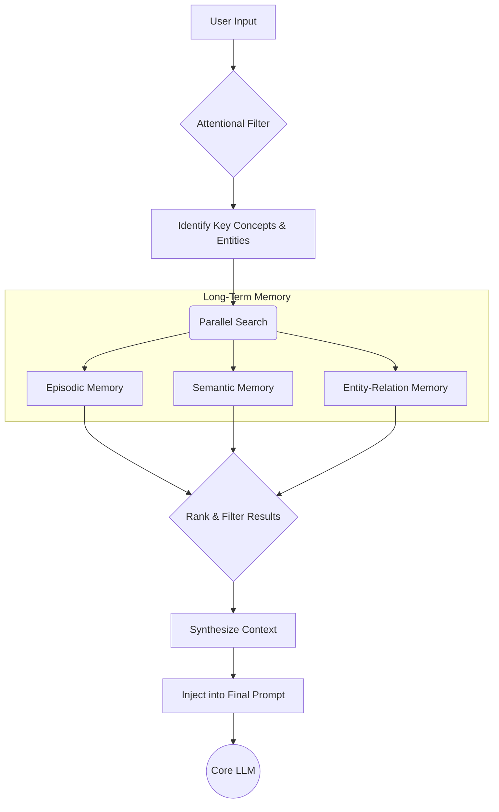
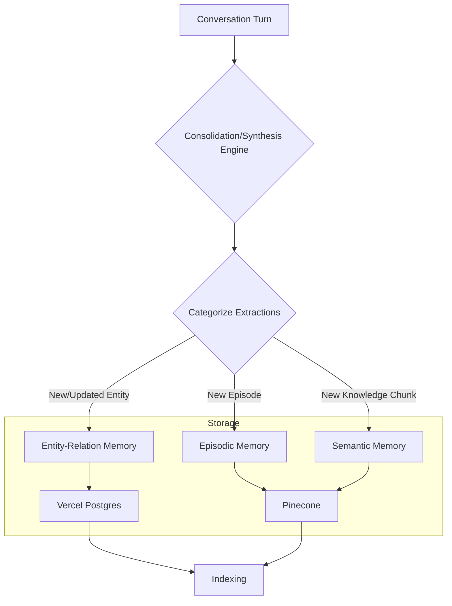

# SoulyCore System Architecture

**Document Version:** 1.0
**Status:** Proposal

---

### 1. Introduction

This document provides a high-level overview of the data flow within the SoulyCore Cognitive Architecture. The system operates primarily through two distinct pipelines: the **Pre-Processing Gauntlet** for context retrieval before generating a response, and the **Memory Consolidation Pipeline** for learning after an interaction.

### 2. Pipeline 1: The Pre-Processing Gauntlet (Context Retrieval)

This pipeline executes every time a user sends a message. Its goal is to arm the core Large Language Model (LLM) with the most relevant context from long-term memory to generate a high-quality, informed response.

#### 2.1 Data Flow Diagram

#### 2.2 Step-by-Step Explanation

1.  **User Input:** The user submits a message through the chat interface.
2.  **Attentional Filter:** A lightweight, preliminary LLM call analyzes the input to determine its core intent and identify key topics.
3.  **Identify Concepts & Entities:** The filter's output is parsed to extract specific search terms, such as names of people, project codenames, or technical concepts.
4.  **Parallel Search:** The system simultaneously queries the relevant long-term memory modules:
    *   **Episodic:** Searches for past conversations with similar topics.
    *   **Semantic:** Searches for definitions and abstract knowledge related to the concepts.
    *   **Entity-Relation:** Retrieves detailed, structured data about any identified entities.
5.  **Rank & Filter Results:** The search results from all modules are collected and ranked for relevance to the original user query. A threshold is applied to discard low-relevance information.
6.  **Synthesize Context:** The top-ranked results are compiled into a concise, structured block of text labeled as "Context".
7.  **Inject into Final Prompt:** This context block is prepended to the user's original message, forming the final, context-rich prompt.
8.  **Core LLM:** The final prompt is sent to the primary Gemini model for response generation.

### 3. Pipeline 2: The Memory Consolidation Pipeline (Learning)

This pipeline runs as an asynchronous, "fire-and-forget" process after a successful user-AI exchange is completed. Its purpose is to continuously learn from interactions.

#### 3.1 Data Flow Diagram

#### 3.2 Step-by-Step Explanation

1.  **Conversation Turn:** The pipeline receives the user's message and the final AI response as a single unit of analysis.
2.  **Consolidation/Synthesis Engine:** A dedicated LLM call is made with a specific prompt designed to extract durable information from the text.
3.  **Categorize Extractions:** The LLM's response (typically structured JSON) is parsed to separate different types of information:
    *   **Entities:** Concrete nouns like "Project Phoenix" or "Alice Johnson".
    *   **Episodes:** The summary of the interaction itself.
    *   **Semantic Chunks:** Standalone facts like "The API key is stored in the environment variable `GEMINI_API_KEY`."
4.  **Route to Memory Module:** Each categorized piece of information is sent to its corresponding memory module's storage function.
5.  **Storage:** The data is persisted in the appropriate database (Vercel Postgres for structured entities, Pinecone for vector-based episodic and semantic memories).
6.  **Indexing:** The databases update their indexes to make the new information immediately available for retrieval in future Pre-Processing Gauntlet runs.